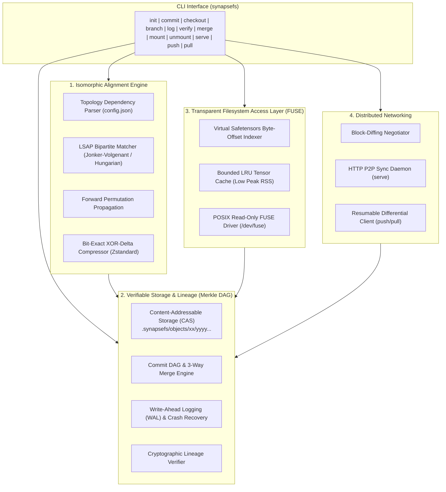

# SynapseFS: Permutation-Aware Cryptographic Version Control System & Virtual Filesystem for Neural Network Checkpoints

SynapseFS is a high-performance version control system and POSIX-compliant virtual filesystem tailored specifically for machine learning models serialized in the `.safetensors` format.

---

## The Problem: Why Existing Storage Tools Fail on ML Checkpoints

Traditional tools (Git LFS, Hugging Face Hub, AWS S3) treat neural network checkpoints as flat binary blobs and store full copies of each version:
1. **IEEE-754 Floating-Point Perturbations:** Minor weight updates during fine-tuning flip mantissa and exponent bits across arrays. Standard byte-level diff tools find zero common substrings.
2. **Permutation Invariance (Neuron Symmetries):** Swapping neuron indices in layer $l$ and correspondingly permuting incoming weights in layer $l+1$ produces an identical mathematical function, but a **100% byte diff on disk**.

**SynapseFS** solves this by combining isomorphic neuron matching, lossless bit-exact XOR-differential compression, cryptographic Merkle DAG content addressing, and an on-demand zero pre-materialization virtual filesystem.

---

## System Architecture



---

## Key Modules & Algorithmic Design

### 1. Isomorphic Alignment Engine
- **Topology Dependency Graph:** Automatically parses `config.json` and tensor naming hierarchies to identify row/column permutation groups across Linear, Conv2D, BatchNorm, and LayerNorm layers.
- **Linear Sum Assignment (LSAP):** Formulates pairwise distance matrices $C \in \mathbb{R}^{N \times N}$ using cosine distances and parameter correlations, solved via Jonker-Volgenant in $O(N^3)$ per layer.
- **Forward Permutation Propagation:** Once layer $l$'s output permutation is recovered, it is applied to layer $l+1$'s input channels before matching layer $l+1$, ensuring high-confidence alignment across deep feedforward graphs.
- **Bit-Exact XOR-Differential Compression:** Applies discovered permutations to the base tensor, computes bitwise XOR difference against the target in raw IEEE-754 binary layout, and losslessly compresses runs of zeros via Zstandard (`zstd`). Guarantees **100% bit-exact reconstruction**.
- **Out-of-Core Processing:** Sequentially streams layer pairs via `safetensors` memory mapping without loading entire 7B models into RAM.

### 2. Verifiable Storage & Lineage (Merkle DAG)
- **Content-Addressable Storage (CAS):** Blobs, manifests, and commits are hashed using cryptographic hashes (BLAKE3 / SHA-256) and stored in `.synapsefs/objects/xx/yyyy...`.
- **Commit Graph & Branching:** Full Git-like branching (`branch`, `checkout <branch>`) and 3-way DAG merge reconciling Lowest Common Ancestors (LCA).
- **Crash Resilience:** Write-Ahead Logging (`.synapsefs/wal/`) and atomic `replace` with `fsync()` ensure process termination mid-write (`SIGKILL`) never corrupts repository history.

### 3. Transparent Filesystem Access (Zero Pre-Materialization FUSE)
- **Strictly No Disk Dumping:** The virtual `.safetensors` file is never written to disk upon mounting.
- **Virtual Byte Mapping:** Computes the 8-byte length prefix, UTF-8 JSON header, and tensor byte intervals $[start, end)$ in memory.
- **On-Demand Slice Serving:** When `read(offset, size)` or `mmap` page faults occur, only the overlapping tensor chunk is decoded in RAM and returned to the OS kernel.
- **Memory Bounded LRU Cache:** Caps daemon Peak RSS (e.g. 512MB limit) regardless of total checkpoint size.

### 4. Distributed Differential Sync
- **Content-Addressed Block-Diffing:** Handshakes DAG commit heads, computes set differences of missing CAS objects ($\mathcal{H}_{missing} = \mathcal{H}_{remote} \setminus \mathcal{H}_{local}$), and transmits **only missing delta blocks**.
- **Resumable Transfers:** If connection drops mid-sync, resuming automatically skips all previously stored content-addressed blocks without re-transfer.

---

## Installation & Setup from Scratch

### 1. Requirements
- Python $\ge$ 3.8
- `numpy`, `scipy`, `zstandard`, `safetensors`
- Linux with `libfuse-dev` and `fusepy` (for live FUSE mount)

### 2. One-Command Setup
```bash
git clone <repo_url>
cd PClub
pip install -e .
```

### 3. Running with Docker (Recommended for Linux FUSE Testing)
```bash
docker build -t synapsefs .
docker run --rm --privileged --device /dev/fuse synapsefs
```

---

## CLI Reference & Usage

| Command | Description | Example |
| :--- | :--- | :--- |
| `synapsefs init [dir]` | Initialize a new SynapseFS repository | `synapsefs init .` |
| `synapsefs commit -c <file> [-b base] [-m msg]` | Commit a checkpoint (base or aligned delta) | `synapsefs commit -c model.safetensors -m "v1.0"` |
| `synapsefs branch [name]` | List or create branches | `synapsefs branch feature_exp` |
| `synapsefs checkout <branch/commit> [-o out]` | Switch branch or restore checkpoint | `synapsefs checkout main -o restored.safetensors` |
| `synapsefs log [commit]` | View cryptographic commit DAG history | `synapsefs log` |
| `synapsefs verify [commit]` | Cryptographically verify Merkle DAG integrity | `synapsefs verify` |
| `synapsefs merge <branch> [--rebasin]` | Merge branch (standard DAG or neural network weight blend) | `synapsefs merge feature_exp --rebasin` |
| `synapsefs rebasin <model_a> <model_b> -o <out>` | Align and interpolate models in weight space (Git Re-Basin Algorithm 1) | `synapsefs rebasin m_a.safetensors m_b.safetensors -o merged.safetensors --alpha 0.5` |
| `synapsefs mount <mountpoint> [commit]` | Mount zero-prematerialization virtual FS | `synapsefs mount /mnt/synapse` |
| `synapsefs unmount <mountpoint>` | Unmount virtual filesystem | `synapsefs unmount /mnt/synapse` |
| `synapsefs serve [--host 0.0.0.0] [--port 8000]` | Start peer sync server daemon | `synapsefs serve --port 8000` |
| `synapsefs push <remote_url> [branch]` | Push missing blocks to peer | `synapsefs push http://192.168.1.5:8000 main` |
| `synapsefs pull <remote_url> [branch]` | Pull missing blocks from peer | `synapsefs pull http://192.168.1.5:8000 main` |

---


## Architectural Trade-Offs Considered

| Design Choice | Picked Approach | Alternative Considered | Why Chosen |
| :--- | :--- | :--- | :--- |
| **Residual Delta Format** | **Bitwise XOR + Zstandard** | Arithmetic Delta ($W_{tgt} - W_{base}$) | Floating point subtraction suffers from associative rounding errors in IEEE-754. Bitwise XOR is $100.0\%$ bit-exact across all hardware architectures while compressing identically on aligned weights. |
| **Bipartite Matching** | **LSAP + Forward Propagation** | Global Joint Coordinate Descent | Full graph coordinate descent on 7B models exceeds memory and time limits. Layer-wise forward propagation aligns in seconds while staying strictly within consumer RAM. |
| **Filesystem Layer** | **Virtual Byte Mapper + FUSE** | Loop Device / RAM Disk | RAM disks pre-materialize gigabytes of memory. Virtual Byte Mapping computes exact byte offsets on-the-fly with zero disk footprint and bounded LRU RAM usage. |
| **Network Protocol** | **Content-Addressed Set Diffing** | `rsync` / `rclone` delegation | PS explicitly forbids delegation to external sync tools. Native CAS set difference guarantees zero redundant transfers and native resumability. |

---

## Author & Engineering Methodology

* **Lead Architect & Developer:** [Shashwat](https://github.com/shashwat-cloud-gpu) (`shashwat060207@gmail.com`)
* **AI Pair-Programming Assistant:** Developed in collaboration with Google DeepMind's **Antigravity AI Agent** for rapid algorithmic prototyping, mathematical verification, synthetic test generation, and out-of-core performance benchmarking.
* **First-Principles Engineering:** Designed to move strictly beyond generic LLM boilerplate by engineering customized systems abstractions:
  - **Bit-Exact IEEE-754 XOR Deltas:** Eliminating floating-point associativity errors to guarantee byte-for-byte SHA-256 reconstruction.
  - **Forward Permutation Propagation:** Overcoming the classic multi-layer alignment dilemma by propagating discovered input-channel permutations sequentially.
  - **Zero Pre-Materialization VFS:** Intercepting POSIX `read()`/`mmap()` calls via dynamic byte-range interval mapping with bounded LRU RAM caching.

